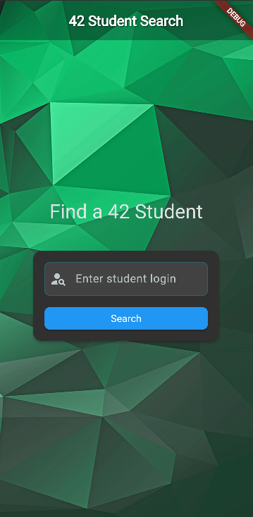

# Swifty Companion

A mobile application developed as part of the 42 school curriculum that allows users to search and view detailed profiles of 42 students using the official 42 API.


### Search Page :
<div align="center">
  
<br>The search interface allows users to find 42 students by their login
</div>

### Profile View :

<div align="center">
  
<br>Detailed profile view showing student information, skills and project history
</div>

## Project Overview

This project introduces mobile application development using Flutter, focusing on:
- Cross-platform mobile development with Dart
- RESTful API integration with OAuth2 authentication
- Client-Server communication
- Responsive UI design for different screen sizes
- Error handling and user experience optimization

## Technologies Used

### Frontend
- **Flutter**: Google's UI toolkit for building natively compiled applications
- **Dart**: Programming language optimized for multi-platform development
- **Provider Pattern**: For lightweight state management
- **Custom Widgets**: Responsive and reusable UI components

### Networking & Data
- **Dio**: Feature-rich HTTP client for API requests
- **flutter_dotenv**: Secure environment variables management
- **JSON Serialization**: Custom model classes for type-safe data handling

### Authentication
- **OAuth2**: Secure token-based API authentication
- **Token Management**: Automatic refresh of expired tokens

## 42 API Integration

The application integrates with the 42 School's API:
- OAuth2 client credentials flow
- RESTful endpoints for student data
- Handling of API rate limits and pagination
- Structured student profile data including:
  - Personal information
  - Skills and competencies with progress levels
  - Project history with status indicators

### API Authentication

```bash
# Example of obtaining an access token
curl -X POST --data "grant_type=client_credentials&client_id=YOUR_CLIENT_ID&client_secret=YOUR_CLIENT_SECRET" https://api.intra.42.fr/oauth/token
```

## Features

### User Interface
- **Search View**: Clean interface for finding 42 students by login
- **Profile View**: Comprehensive student profile display with:
  - Profile picture and personal information
  - Current location status
  - Interactive skills visualization with progress bars
  - Project history with completion status
  - Visual indicators for project success/failure

### User Experience
- **Error Handling**: Intuitive error messages for network issues or user not found
- **Loading States**: Smooth loading indicators during API requests
- **Responsive Design**: Adapts to different screen sizes and orientations
- **Visual Feedback**: Color-coded indicators for student status and project outcomes

### Security
- **Environment Variables**: Secure storage of API credentials
- **Token Management**: Proper handling of OAuth tokens
- **No Credential Storage**: API secrets never stored in the application code

## Project Structure

```
lib/
  ├── config/               # App configuration and environment
  ├── core/                 # Core functionality
  │   ├── errors/           # Custom exceptions and error handling
  │   └── network/          # API clients and OAuth2 implementation
  ├── data/                 # Data layer
  │   └── models/           # Data models (User, Project, Skill)
  ├── domain/               # Business logic
  │   ├── entities/         # Core business entities
  │   └── repositories/     # Data source implementations
  └── presentation/         # UI layer
      └── pages/            # App screens (Search, Profile)
```

## Setup Instructions

### Prerequisites
- Flutter SDK (2.10.0 or higher)
- Dart (2.16.0 or higher)
- 42 API credentials (UID and Secret)

### Installation

1. Clone the repository
```bash
git clone <repository-url>
cd swifty_companion
```

2. Create a `config.env` file in the project root with your 42 API credentials:
```
API_UID=your_42_client_id
API_SECRET=your_42_client_secret
API_URL=https://api.intra.42.fr/v2
API_OAUTH_URL=https://api.intra.42.fr/oauth/token
```

3. Install dependencies
```bash
flutter pub get
```

4. Run the application
```bash
flutter run
```

or use the full run script to install dependencies and run the application: 
```
./rebuild+run.sh
```

## Implementation Details

### OAuth2 Token Management
The application implements a robust token management system that:
- Securely stores API credentials in environment variables
- Obtains access tokens using the client credentials flow
- Automatically refreshes tokens when they expire
- Handles authentication errors gracefully

### User Search & Profile Display
- Efficient API requests with proper error handling
- Optimized data models for type safety
- Responsive UI that adapts to different screen sizes
- Intuitive navigation between search and profile views

## Security Considerations

This project follows security best practices:
- API credentials are stored in a non-committed `.env` file
- OAuth tokens are managed securely and never persisted in plain text
- Network requests use HTTPS for secure communication
- Error messages are user-friendly without exposing sensitive information
